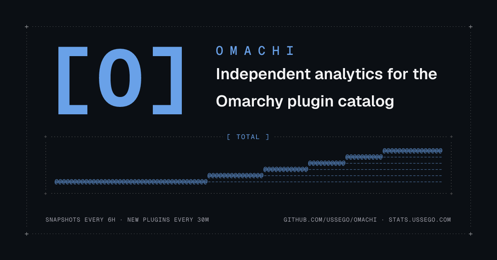

# omastats

Analytics dashboard for the Omarchy plugin catalog. Cloudflare Worker (Hono) +
D1, React SPA frontend (TanStack Router + Query, coss ui, dither-kit charts).

<p align="center">
  
</p>

The share card and favicon render at build time with
[takumi](https://takumi.kane.tw), no headless browser, using the same
dither-kit engine the charts run on. See [Brand assets](#brand-assets).

## Architecture

- **Cadence**: scheduled workflows in `.github/workflows/`. `light-poll.yml`
  every 30 min, `heavy-poll.yml` every 6 h; each `curl`s the matching
  `/api/admin/...` endpoint with the `ADMIN_TOKEN` GitHub secret. The
  Worker's `scheduled()` handler stays for `wrangler triggers` and local
  miniflare. Implementation: `src/lib/light-poll.ts`, `src/lib/snapshot.ts`.
- **D1**: `plugins` (dimension, carries denormalized `current_*` so leaderboard/
  list reads never scan snapshots), `plugin_snapshots` (fact, 90-day retention),
  `verification_events` / `update_events` (derived).
- **API** served by the same Worker (see routes below).

Both upstream endpoints are current-state snapshots; history only accumulates
from the first cron run onward. GitHub Actions cron has no SLA — a missed
firing is not retried. If the original "failing occasionally" was caused by
Workers CPU/D1 caps, this migration does not fix that.

## Brand assets

`bun run assets` renders the brand images into `public/` with takumi. Build
time only; the Worker bundle never imports it.

- **`og.png`** - the 1200×630 share card above.
- **`favicon.ico`** (16/32/48) and **`favicon.png`** (64) - a blue dither "o"
  on the dark rounded tile.

<p align="center">
  
</p>

Both reuse the site's own dither engine. `scripts/assets.tsx` imports
`paintColumn` and the palette seeds from `src/components/dither-kit/`,
rasterizes them to raw-RGBA bitmaps, and blooms them the same way the charts
bloom. `bun run build` runs `assets` first, so the deployed copy stays
current, and the script prints an ASCII preview of the favicon while it
renders.

## Setup

```txt
bun install
bun run assets       # regenerate public/og.png + favicons (also runs on build)
bun run db:generate    # regenerate migrations from src/db/schema.ts
bun run db:migrate:local   # apply migrations to local D1
bun run db:migrate:remote  # apply migrations to remote D1
bun run cf-typegen     # regenerate worker-configuration.d.ts from wrangler.jsonc
bun run dev            # local dev (miniflare + D1 at .wrangler/state)
```

Trigger a snapshot manually in dev:

```txt
curl -X POST http://localhost:5173/cdn-cgi/mf/scheduled
```

Or against production (admin token; same value lives as the
`ADMIN_TOKEN` Cloudflare Worker secret and the GitHub repo secret):

```txt
curl -X POST -H "x-admin-token: $ADMIN_TOKEN" https://stats.ussego.com/api/admin/snapshot
curl -X POST -H "x-admin-token: $ADMIN_TOKEN" https://stats.ussego.com/api/admin/light-poll
```

## Deploy

Production deploys are driven by `.github/workflows/deploy.yml` on every
push to `main` (and on manual `workflow_dispatch`). The workflow runs
typecheck, lint, and `snapshot.selftest.ts` before `bun run deploy`, so a
broken main can't ship. It authenticates with the `CLOUDFLARE_API_TOKEN`
repo secret (a scoped Cloudflare API token, see the workflow file for the
required permissions).

To deploy locally instead, use the same command the action uses:

```txt
bun run deploy
```

`bun run deploy` does **not** run D1 migrations. Apply schema changes
manually with `bun run db:migrate:remote` after reviewing the generated
SQL — AGENTS.md: "Remote applies immediately: additive columns are safe,
destructive changes are not."

## API routes

| Route | Description |
|---|---|
| `GET /api/health` | last snapshot time, plugin/snapshot counts |
| `GET /api/plugins?q=&category=&author=&kind=&verification=&page=&pageSize=` | list/search plugins + latest stats |
| `GET /api/plugins/:id` | plugin detail, full snapshot history, averages |
| `GET /api/stats/published?range=&groupBy=day\|month\|year&from=&to=` | publish counts over time (from `added_at`) |
| `GET /api/stats/updated?...` | update-event counts over time |
| `GET /api/stats/verified?...&toStatus=verified` | verification-transition counts over time |
| `GET /api/stats/categories` | per-category count + avg hearts/views/copies |
| `GET /api/stats/breakdown` | verification-status + install-status counts, totals |
| `GET /api/stats/heatmap?from=&to=` | category × month counts (from `added_at`) |
| `GET /api/leaderboard/:metric?limit=&sparkPoints=` | top N by `hearts`/`views`/`copies`/`copies_per_view`; `sparkPoints` embeds per-row snapshot history |
| `GET /api/leaderboard/trending?days=7\|30` | biggest hearts/views growth in the last N days |
| `GET /api/authors/leaderboard` | aggregate stats per author |
| `GET /api/badges/:stat/:id` | shields.io endpoint badge — a plugin's stat (`id` with a dot) or an author's total (bare `id`); `?label=`/`?color=` override badge text/color |
| `GET /api/badges/ranking/:stat/:id` | competition-rank badge (1 = highest, ties share a place); `stat` may also be `avg` |
| `GET /api/health/broken` | plugins with unreachable/failed upstream or repo untouched >365d |
| `POST /api/admin/snapshot` | force a heavy poll now; header `x-admin-token` (Worker secret `ADMIN_TOKEN`) |
| `POST /api/admin/light-poll` | force a light poll now; header `x-admin-token` (Worker secret `ADMIN_TOKEN`) |

`range` accepts `30d|90d|180d|365d|1y|all`; `from`/`to` are ISO dates. Buckets are UTC-based (ISO strings).

## Charts

JSON chart data sourced from omastats's own D1, rendered by
[shieldcn](https://shieldcn.dev) — omastats doesn't render SVG. Point
shieldcn's `/chart/json.svg` at these endpoints (the JSON shape matches its
JSONPath example verbatim: `query=$.points[*].count` +
`dateQuery=$.points[*].date`).

```
/api/charts/omastats/published.json              new plugins per period (addedAt)
/api/charts/omastats/updated.json                plugin updates per period (update_events)
/api/charts/omastats/verified.json               verification events per period (verification_events)
/api/charts/omastats/verified.json?toStatus=broken filtered to one transition
/api/charts/omastats/total.json                  cumulative plugin count (always-rising)
/api/charts/plugin/{id}/hearts.json              single plugin's hearts over time
/api/charts/plugin/{id}/views.json               single plugin's views over time
/api/charts/plugin/{id}/copies.json              single plugin's copies over time
/api/charts/author/{login}/hearts.json           author's total hearts across their plugins
/api/charts/author/{login}/views.json            author's total views across their plugins
/api/charts/author/{login}/copies.json           author's total copies across their plugins
```

The `.json` extension is optional. `?groupBy=day|month|year` defaults to
month. These routes are edge-cached like the rest of `/api/*`.

Embed in markdown:

```md

```

For inline `?values=` charts, GitHub / npm charts, or arbitrary-JSON charts,
use [shieldcn](https://shieldcn.dev) directly — omastats charts are
intentionally scoped to its own catalog data.
